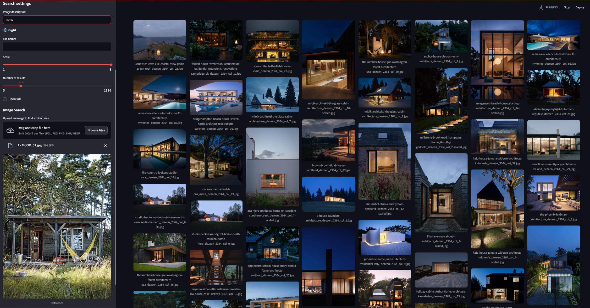

# AI-PhotoSearch

AI-powered local image search application. Search through your local photo collection using natural language descriptions or similar images.



## ✨ Features

- **🔍 Text-based Search** - Find images using natural language descriptions
- **🖼️ Image-based Search** - Upload a reference image to find similar photos
- **🤖 Multiple AI Models** - Support for various CLIP models (ViT-B-32, ViT-B-16, ViT-L-14, ViT-L-14-336)
- **🌐 Auto Translation** - Automatic translation between Russian and English with caching
- **⚡ Smart Caching** - Incremental indexing system for fast performance
- **🎯 GPU Acceleration** - CUDA support for faster processing
- **📁 Folder History** - Remember and quickly switch between image folders

## 🚀 Quick Start

### 1. Download the Project
```bash
git clone https://github.com/RomanLos/AI_PhotoSearch.git
cd AI_PhotoSearch
```

### 2. Download Required Components
**Download from Yandex Disk:** [AI-PhotoSearch Components](https://disk.yandex.ru/d/kFrhkJEGcFq3kw)

Extract the downloaded archive and copy:
- `system/` folder (Portable Python) → to project root
- `models/` folder (AI models) → to project root

## 📁 Project Structure

```
AI_PhotoSearch/
├── AI_PhotoSearch.bat             # Launch application
├── AI_PhotoSearch_Update.bat      # Update to latest version
├── app2.py                        
├── README.md                      
├── .gitignore                     
├── screenshot.png                 
├── ️system/                        # Portable Python (download separately)
│   ├── python
├── models/                        # AI models (download separately)
│   ├── dinov2_vitb14_pretrain.pth 
│   ├── ViT-B-32.pt                
│   ├── ViT-B-16.pt
│   └── ViT-L-14.pt
├── cache/                         # Generated automatically
└── last_used_paths.pkl            # Generated automatically
```

### 3. Run the Application
```bash
# Double-click to run
AI_PhotoSearch.bat
```


## 🎮 How to Use

### 1. **Select Image Folder**
- Choose a folder containing your images
- The app will automatically index images (first time only)
- Supports: JPG, PNG, WebP, BMP, TIFF

### 2. **Search Methods**

#### Text Search 🔤
```
"красивый закат над морем"
"beautiful sunset over ocean"
"cat sleeping on a sofa"
"собака бегает по парку"
```

#### Image Search 🖼️
- Upload a reference image
- Find visually similar photos in your collection

#### Combined Search 🔄
- Upload reference image + add text description
- Most powerful search method

### 3. **Customize Results**
- **Scale**: Adjust thumbnail size (1-8 columns)
- **Results**: Set number of images to show (5-1000)
- **Show All**: Display entire collection

## 💻 System Requirements

- **OS**: Windows 10/11
- **GPU**: NVIDIA GPU with CUDA support (recommended)
- **RAM**: 8+ GB recommended
- **Storage**: 2GB+ free space for models and cache

## 🔄 Updates

To get the latest features and improvements:
```bash
# Double-click to update
AI_PhotoSearch_Update.bat
```

The update script will:
- ✅ Check for new versions
- ✅ Download latest code
- ✅ Preserve your settings
- ✅ Show changelog

## 🛠️ Technical Details

### AI Models Used
- **CLIP**: Text-image understanding (OpenAI/OpenCLIP)
- **DINOv2**: Visual similarity search (Meta AI)
- **Translation**: Google Translate API

### Performance Features
- **Incremental Indexing**: Only new images are processed
- **Batch Processing**: GPU-optimized batch inference
- **Smart Caching**: Embeddings cached for instant search
- **Translation Cache**: Repeated queries are instant

## ❓ Troubleshooting

### Common Issues

**"No GPU detected"**
- Install NVIDIA drivers
- Ensure CUDA is available
- App will work on CPU (slower)

**"Models not found"**
- Download models from [Yandex Disk](https://disk.yandex.ru/d/kFrhkJEGcFq3kw)
- Place in `models/` folder

**"Slow indexing"**
- First-time indexing takes time
- Subsequent runs are much faster
- Consider smaller image folders for testing

**"Update failed"**
- Ensure Git is installed
- Check internet connection
- Try running as administrator

## 🤝 Contributing

1. Fork the repository
2. Create a feature branch (`git checkout -b feature/amazing-feature`)
3. Commit your changes (`git commit -m 'Add amazing feature'`)
4. Push to the branch (`git push origin feature/amazing-feature`)
5. Open a Pull Request

## 📝 License

This project is licensed under the MIT License - see the [LICENSE](LICENSE) file for details.

## 🙏 Acknowledgments

- [OpenAI CLIP](https://github.com/openai/CLIP) - Text-image understanding
- [OpenCLIP](https://github.com/mlfoundations/open_clip) - Open source CLIP implementation
- [DINOv2](https://github.com/facebookresearch/dinov2) - Self-supervised vision transformers
- [Streamlit](https://streamlit.io/) - Web app framework

## 📧 Support

If you encounter any issues or have questions:
- 🐛 [Open an Issue](https://github.com/RomanLos/AI_PhotoSearch/issues)
- 💬 [Discussions](https://github.com/RomanLos/AI_PhotoSearch/discussions)

---

**⭐ If you find this project useful, please give it a star!**